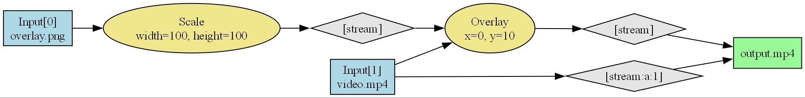

# FFmpeg-studio

[](https://pypi.org/project/ffmpeg-studio/)
[](LICENSE)
[](https://electro199.github.io/ffmpeg-studio/)
[](https://github.com/electro199/ffmpeg-studio/stargazers)

ffmpeg-studio provides a Pythonic interface to FFmpeg, allowing users to construct and execute FFmpeg commands programmatically.

It simplifies and Handles:

- Complex filter generation
- All popular Filters and Baseclass for custom filters
- Automatic Safe quoting & escaping
- Input handling & stream selection
- Output mapping & stream selection
- Progress tracking with callbacks
- Allows direct flags in command.
- Scanning metadata with ffprobe.
- Long filter graphs.



## Installation

From PyPi

```sh
pip install ffmpeg-studio
```

From Source

```sh
pip install git+https://github.com/electro199/ffmpeg-studio.git
```

## Usage

ffmpeg-studio support complex Filters and can be used with [`apply`](https://electro199.github.io/ffmpeg-studio/api/#ffmpeg.filters.apply) or [`apply2`](https://electro199.github.io/ffmpeg-studio/api/#ffmpeg.filters.apply2).

```py
from ffmpeg import FFmpeg, InputFile, FileInputOptions, Map
from ffmpeg.filters import apply, Scale, Overlay

# set options
clip = InputFile("video.mp4", FileInputOptions(duration=10))
overlay = InputFile("overlay.png")

# apply scale filter on clip
upscaled_clip = apply(Scale(1440, 1920), clip)

# apply scale filter on overlay
overlay = apply(Scale(100, 100), overlay)

# apply overlay filter with overlay on upscaled_clip
upscaled_clip = apply(Overlay(overlay, x=0, y=10), clip)

ffmpeg = FFmpeg()

# add output
ffmpeg.output(upscaled_clip, path="out.mp4")

# run command
ffmpeg.run(progress_callback=print)

```

For simple media conversion :

```py
clip = VideoFile("video.mp4")

export(
   clip,
   path="out.mkv",
).run()

```

## Quick Examples

### Trim a video

```py
clip = VideoFile("video.mp4").subclip(start=5, duration=10)

export(clip, path="trimmed.mp4").run()
```

### Get meta data info

Use builtin support for ffprobe

```py
VideoFile("video.mp4").get_duration() # 10.33 seconds
VideoFile("video.mp4").get_size()  # (1920, 1080)

AudioFile("audio.mp3").get_duration() # 30.00 seconds

ImageFile("image.jpeg").get_size()  # (1920, 1080)
```

### Extract Audio/Video/Subtitle from a video

Extract or reference streams:

```py
video = VideoFile("video.mkv")

# get audio(s)/subtitles(s)
audio = video.audio
subtitle = video.subtitle

# get specific stream
audio_1 = video.get_stream(stream_name="a", stream_index=1)
video_1 = video.get_stream(stream_name="V", stream_index=1)
subtitle_1 = video.get_stream(stream_name="s", stream_index=1)

# Now you can use them in filter or export
export(..., path=...).run()
```

List the all streams in the video file autiomatically with builtin ffprobe support.
The for-loop will tigger the ffprobe to get list all streams:

```py
video = VideoFile("video.mkv")

for stream in video:
    print(stream, stream.metadata["codec_type"])

# <StreamSpecifier stream_index=0> video
# <StreamSpecifier stream_index=1> audio
# <StreamSpecifier stream_index=2> subtitle
```

### Merge separate video and audio(s) files

```py
video = VideoFile("video.mp4")
audio = AudioFile("audio.mp3")

ffmpeg = FFmpeg()
ffmpeg.output(video.video, audio, path="merged.mp4")
ffmpeg.run()
```

### Add a watermark/logo overlay

```py
video = VideoFile("video.mp4")
logo = ImageFile("logo.png")

watermarked = apply(Overlay(logo, x=10, y=10), video)

ffmpeg = FFmpeg()
ffmpeg.output(watermarked, path="watermarked.mp4")
ffmpeg.run()
```

More recipes and full explanations are in the [docs](https://electro199.github.io/ffmpeg-studio/), including [Cookbooks](https://electro199.github.io/ffmpeg-studio/cookbooks/) and [Examples](https://electro199.github.io/ffmpeg-studio/example/format_conversion/).

## Install FFmpeg

This project does not install ffmpeg utility automatically.

Verify ffmpeg is installed:

```sh
ffmpeg -version
```

<details>

<summary>Windows Install</summary>

Using winget:

```sh
winget install --id=Gyan.FFmpeg  -e
```

or download and install FFmpeg from [FFmpeg official website](https://ffmpeg.org/download.html):

1. Download the latest FFmpeg build from [here](https://www.gyan.dev/ffmpeg/builds/).
2. Extract the archive and add the `bin` directory to your system `PATH`.

</details>

<details>

<summary>MacOS Install</summary>


Using Homebrew:

```sh
brew install ffmpeg
```

</details>

<details>

<summary>Linux Install</summary>

For Debian/Ubuntu:

```sh
sudo apt install ffmpeg
```

</details>
